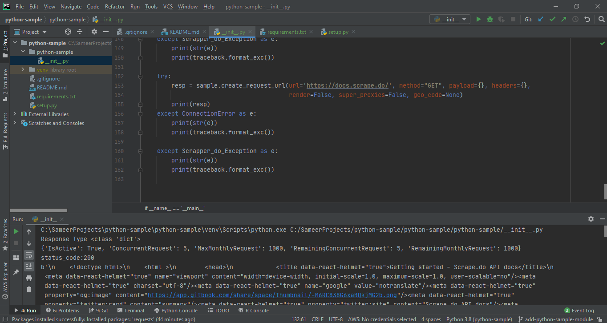

# Scrape.do python-sample

    

Web Scraper API

- Best Rotating Proxy & [Scraping API](https://scrape.do/) Alternative.
- :warning: Please read the [documents](https://scrape.do/docs/getting-started) first.

#### You can send request to any webpages with proxy gateway & web api provided by scrape.do. As you can see from the example, this takes only few lines of code

#### You can see Example here ([test.py](/test.py))

## Usage

first you need to create python_sample as [python-sample](/python_sample_scrape_do/__init__.py)

and use python_sample class to handle scrape.do api's

    from python_sample_scrape_do import Scrape_do_Exception, python_sample

    API_TOKEN = "Your_API_TOKEN_FOR_scrape.do"

    # create an python-sample object
    sample = python_sample()

    # set the scrape.do api key
    sample.set_api_token(api_token=API_TOKEN)

    # Get Scrape.do account statistics
    try:
        resp = sample.account_status()
        print("Response Type " + str(type(resp)))
        print(resp)
    except ConnectionError as e:
        print(str(e))
        print(traceback.format_exc())

    except Scrape_do_Exception as e:
        print(str(e))
        print(traceback.format_exc())

    try:
        resp = sample.create_request_url(url='https://docs.scrape.do/', method="GET", payload={}, headers={},
                                         render=False, super_proxies=False, geo_code=None)
        print(resp)
    except ConnectionError as e:
        print(str(e))
        print(traceback.format_exc())

    except Scrape_do_Exception as e:
        print(str(e))
        print(traceback.format_exc())

### Screenshot

 

  
